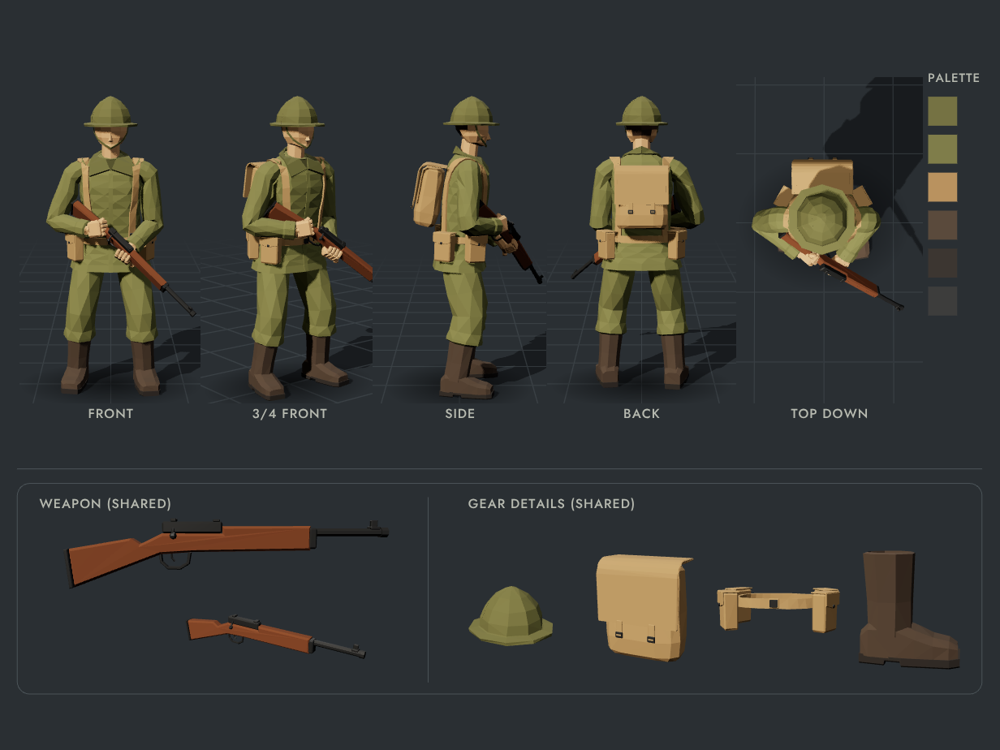

# Low-Poly Rifleman

A low-poly infantry rifleman rebuilt in 3D from the character sheet: faceted brim helmet with chin strap, olive tunic with fold-down collar, shoulder braces, belt with four ammo pouches, field pack, bloused trousers, boots and a bolt-action rifle. The gear and details follow the sheet; the body has realistic adult proportions. It's rigged as a humanoid, the gear is modular, and it's ready to drop into a game engine.



## What's here

| Path | What it is |
| --- | --- |
| `index.html` | The viewer. One self-contained file: open it in a browser, no install or server needed. |
| `models/rifleman.glb` | Game-ready model in the reference loadout: mesh, skeleton, materials, 6 animation clips. |
| `models/rifleman-modular-kit.glb` | The same rig with **every** gear variant included as its own mesh, for swapping gear in your engine. |
| `src/soldier/` | The model source (procedural three.js geometry, rig, poses, animations). |
| `src/viewer/` | The viewer UI. |
| `tools/` | Build, export, validation and screenshot scripts. |

## The viewer

Open `index.html`. You can:

- **Orbit / zoom / pan** the model and jump to the same five camera angles as the sheet (Front, 3/4 Front, Side, Back, Top down), or turn on the turntable.
- **Switch to "Turnaround sheet"** to get a live version of the reference board: five views, palette column, and the weapon and gear panels. It updates with whatever loadout and colours you pick. **Save image** exports it as a PNG.
- **Change gear** per slot (headgear, backpack, harness, belt kit, footwear, weapon). The `ref` tag marks the item that matches the original sheet.
- **Recolour** any of the nine palette slots, or pick a preset (olive drab, desert, winter, field grey, jungle, navy).
- **Play animations**: Ready (the sheet pose), Idle, Walk, Run, Aim, A-pose.
- **Download GLB** for the current loadout, or the **modular kit**.

Your loadout and colours are remembered in the browser.

## Using the model in a game

Both GLBs are glTF 2.0 binary files. They pass the Khronos glTF validator with no errors or warnings.

| Property | Value |
| --- | --- |
| Units / axes | metres, Y-up, character faces +Z (glTF convention) |
| Height | 1.92 m (1.98 m with helmet), adult proportions of about 7.4 heads |
| Triangles | ≈ 6,200 for the reference loadout (flat-shaded, hard normals) |
| Skeleton | 30 bones, humanoid names |
| Bind pose | A-pose (arms 45° down). The rifle-ready pose is saved as the default pose. |
| Materials | 11 flat-colour PBR materials: one per palette slot, plus two darker shades of the uniform colour that follow it when you recolour: `collar` and `shirt` (seen in the collar opening) |
| Animations | `Ready`, `Idle` (4 s loop), `Walk` (1.1 s in-place loop), `Run` (0.72 s in-place loop), `Aim`, `APose` |

**Bones:** `Root › Hips › Spine › Chest › Neck › Head`, plus for each side `LeftShoulder › LeftUpperArm › LeftLowerArm › LeftHand` (with `LeftFingers1/2` and `LeftThumb1/2`) and `LeftUpperLeg › LeftLowerLeg › LeftFoot › LeftToes`. Unity's Humanoid avatar, Unreal's IK Retargeter and Godot's humanoid profile can all map these names automatically, so other humanoid animations (Mixamo etc.) can be retargeted onto the character.

**Gear nodes:** every item is a separate mesh skinned to the same skeleton, so you enable or disable items to change the loadout:

| Slot | Nodes |
| --- | --- |
| Body | `Body` (head, uniform, hands; always on) |
| Headgear | `Head_brodie` (sheet), `Head_pot`, `Head_cap` |
| Backpack | `Back_field` (sheet), `Back_sides`, `Back_rucksack` |
| Harness | `Harness_braces` |
| Belt kit | `Belt_pouches` (sheet), `Belt_canteen`, `Belt_plain` |
| Footwear | `Feet_boots` (sheet), `Feet_gaiters` |
| Weapon | `Weapon_rifle` (sheet), `Weapon_carbine`, `Weapon_smg`, under `RightHand › WeaponSocket` |

In `rifleman-modular-kit.glb` all of these are switched on, so hide the ones you don't use. Weapons sit on a socket on the right hand: parent your own weapon models to `WeaponSocket` to equip them. The clips animate the socket as well as the bones, because the right hand holds the rifle differently at the ready (fist round the wrist of the stock) and when aiming (firing grip).

### Engine notes

- **Unity**: import with [glTFast](https://docs.unity3d.com/Packages/com.unity.cloud.gltfast@latest) (or UniGLTF). Each gear item becomes a `SkinnedMeshRenderer` under the model, so toggle the GameObjects. For retargeting, set the rig to Humanoid. The clips import as animation clips.
- **Unreal Engine 5**: drag the GLB into the Content Browser (Interchange glTF importer) and import as a Skeletal Mesh. Clips arrive as Animation Sequences. Gear items are separate mesh sections or components you can hide.
- **Godot 4**: drag the GLB into the FileSystem dock. Gear items are `MeshInstance3D` nodes under the `Skeleton3D`, and the clips are in the `AnimationPlayer`.
- **three.js / Babylon.js**: load with `GLTFLoader` and play clips with an `AnimationMixer`.

## Adding your own gear

Gear is generated by small builder functions in `src/soldier/parts/`. A builder returns a `Poly` (a polygon mesh in metres, in the bind pose) with each face tagged with a palette slot and each vertex bound to a bone. Anything on the arms is modelled straight out along X and then rotated into the A-pose with `armBindMatrix()` from `rig.js`:

```js
// src/soldier/parts/headgear.js
export function buildBeret() {
  const beret = axisTube([[0, 0.15, 0.16], [0.05, 0.17, 0.18], [0.07]], { n: 12, mat: 'olive' });
  beret.translate(0, 1.6, 0);
  return beret.bone('Head'); // rigid on the head bone
}
export const HEADGEAR = { /* ... */ beret: { label: 'Beret', build: buildBeret } };
```

Register it in the slot's table (`HEADGEAR`, `PACKS`, `BELTS`, `HARNESS`, `FOOTWEAR`, `WEAPONS`). It then shows up in the viewer's loadout panel and in the GLB exports. Anything that follows the body (straps, belts) can use the jacket-surface helpers in `body.js` (`torsoPoint`, `torsoSurface`, `torsoMesh`).

Parts are modelled at the sheet's proportions and then fitted to the adult body by `src/soldier/proportions.js`, which moves every vertex with the bones it is skinned to (cloth on the trunk and legs stretches, the head and helmet scale together, arm parts move with the shoulder). Rigid kit that should keep its size, like a pouch or a pack, declares an anchor instead: `fit: { anchor: [x, y, z] }` in its table entry. The same file holds the proportion settings (`KEYS` for joint heights, `HEAD_SCALE`, neck length, chest width).

## Development

```bash
npm install
npm run build      # bundles src/ into index.html (+ dist/artifact.html)
npm run dev        # rebuild on change
npm run export     # writes models/*.glb from the built viewer (headless Chromium)
npm run validate   # Khronos glTF validator on models/*.glb
npm run shots      # renders the five sheet views to out/ for comparison
```

The bundle inlines three.js, so `index.html` works offline. Fonts load from Google Fonts when online and fall back to system fonts when not.

## Notes on matching the sheet

Colours, gear details and the shape of the clothing were measured from the sheet, and the colours were calibrated against the rendered pixels. The sheet's figure is stylised (big head, no visible neck, short legs). The model keeps its look but has adult proportions: legs and trunk about 15% longer, a smaller head on a visible neck, and shoulders that slope down from the neck like the sheet's. The tunic, sleeves and trousers break into the same kind of faceted cloth folds, and the collar is a shade darker than the tunic so it reads clearly. Widths at every height were measured against the sheet's front, side and back views after allowing for the longer body. The five views on the sheet don't agree exactly on the rifle angle: the side view shows it pointing further forward than the front view allows. The pose follows the front and 3/4 views, where the rifle crosses the body from the right chest down to the left knee.

The walk and run are in-place cycles built from gait measurements: heel strike, roll over the foot and toe-off, a straight knee in mid-stance and a folded knee in swing, with the pelvis turning, dipping and bobbing (the run has a flight phase with both feet off the ground). The rifle stays at the ready in both. When aiming, the butt is bedded in the shoulder pocket and the head rests on the stock with the eye behind the sights.
